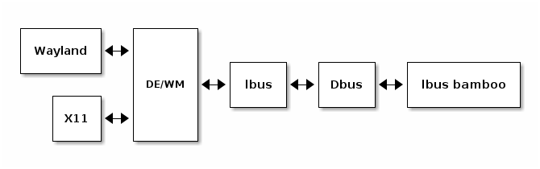

= Hacking on ibus-bamboo

Đây là tài liệu để có thể giúp bạn hình dung rõ về cách hoạt động của ibus-bamboo và giúp cho bạn có 1 cái nhìn tổng quát để có thể đóng góp cho dự án. Lưu ý đây không phải là hướng dẫn lập trình cơ bản người đọc phải có kiến thức lập trình trước khi đọc bộ tài liệu này. Cảm ơn bạn đã đọc.

Nếu bạn thấy tài liệu này còn thiếu sót có thể mở 1 Pull Request để đóng góp cho dự án. Mình sẽ sẵn sàng đón nhận.

== Sơ lược (Overview)

Ibus-bamboo được quản lý với version control là Git vì vậy hãy hiểu git trước khi tham gia đóng góp cho dự án.

Ibus-bamboo được viết với đa phần với ngôn ngữ Go còn lại là C, shell script và Makefile. Để ibus-bamboo có thể hoạt động bạn cần phải có thêm phần mềm Ibus là 1 phần mềm nhập liệu hệ thống. Ibus-bamboo sẽ tương tác với Ibus thông qua Dbus và từ đó các văn bản có thể được hiển thị trên màn hình GUI của bạn. Dưới đây là 1 sơ đồ biểu thị sự tương tác giữa chúng bạn có thể tham khảo.

== Biên dịch mã nguồn (Build project)

Để có thể viết code và gửi Pull Request lại cho dự án bạn cần phải biên dịch và chạy thử chương trình trước khi gửi. Mục này sẽ giúp bạn có thể cấu hình hệ thống và biên dịch chương trình.

Các phụ thuộc chương trình cần để xây dựng

- make
- go
- gtk3
- libX11
- libXtst

Phụ thuộc cần để chạy chương trình là

- dbus 
- ibus

Hãy lấy 1 code từ repo về thông qua git mà xây dựng chương chình bằng lệnh sau tùy theo bạn dùng Linux hay BSD.

[bash]
----
# Linux
sudo make build PREFIX=/usr

# FreeBSD
sudo gmake build PREFIX=/usr/local
----

Sẽ có 1 file ibus-bamboo-engine được xuất hiện. Hãy chạy nó khi ibus-daemon của bạn đã được khởi động.

[bash]
----
./ibus-bamboo-engine
----

Lúc này bạn có thể gõ chương trình bằng tiếng Việt.

Tùy các linux hay bsd bạn sẽ cần phải cài đặt phụ thuộc trên hệ thống trước khi biên dịch chương trình. Bạn có thể tham khảo trên link:https://github.com/BambooEngine/ibus-bamboo/wiki/H%C6%B0%E1%BB%9Bng-d%E1%BA%ABn-c%C3%A0i-%C4%91%E1%BA%B7t-t%E1%BB%AB-m%C3%A3-ngu%E1%BB%93n[Wiki] nếu hệ thống của bạn đã được ghi lại.

== Cấu trúc dự án (Project Structure)

**Sẽ được ghi chép lại trong tương lai. Hãy chờ nhé <3**

== Thư viện của dự án (Project libraries)

Hiện tại các thư viện Go chính mà dự án đang sử dụng là

- BambooEngine/goibus : dùng để tương tác với Ibus thông qua Dbus
- BambooEngine/bamboo-core : để xử lý các thao tác nhập liệu tiếng Việt (dường như code này đã ổn định và bạn không cần phải động tới)
- dkolbly/wl : Wayland API được bọc bằng Go tuy nhiên không còn bất cứ cập nhập nào từ dự án này nên có thể chúng ta sẽ phải fork và duy trì thêm.

Như vậy mình cũng sẽ chỉ nói về goibus và bamboo-core

=== goibus

**Sẽ được ghi chép lại trong tương lai. Hãy chờ nhé <3**

=== bamboo-core

**Sẽ được ghi chép lại trong tương lai. Hãy chờ nhé <3**

== Mã nguồn dự án (Project source code)

**Mục này vẫn còn trong quá trình ghi chép. Hãy chờ để nó được cải thiện hơn trong tương lai nhé <3**

Để hiểu phần mềm bạn phải đọc mã nguồn của dự án và bắt đầu viết thêm code cho dự án theo tùy ý bạn muốn.

Thực tế không có 1 quy định cụ thể nào về việc bạn nên đọc code từ đâu vì đó tùy thuộc vào việc bạn muốn làm gì với dự án nhưng để có thể hiểu rõ được phần mềm đang làm gì nhất thường chúng ta sẽ bắt đầu đọc từ các hàm file chính của dự án hay hàm `main()` và xem các hàm và phương thức nó gọi từ hàm `main()`.

Đừng quá sợ việc đọc code của dự án. Nếu bạn cảm thấy khó khăn có thể tạo 1 cuộc thảo luận trên Github chính của dự án nếu ai đó biết họ sẽ giúp đỡ bạn.

== Các câu hỏi thường gặp (Frequently Asked Questions)

=== Câu hỏi 1: Mình muốn đóng góp code cho dự án nhưng mình không biết phải bắt đầu thế nào? Bạn giúp mình được chứ.

Mình không thể chỉ bạn 1 cách trực tiếp và tận tình được. Trên thực tế các open source contributor đều tự học 1 mình mà không có hay nhận rất ít bất kỳ sự trợ giúp từ người khác. Tuy vậy mình vẫn có thể đề xuất 1 nguồn tư liệu để bạn có thể học tập 1 nguồn tư liệu mà giúp bạn học khá nhanh đó là link:https://go.dev/tour/list[A tour of Go] của Google và các contributors của họ. Bạn sẽ vừa viết code trên Web và học syntax mà không cần phải cài đặt gì hết. Nếu bạn không làm được bài tập thì trên đó thì cũng đừng qua lo lắng, bạn có thể bỏ qua và bay vô việc giải quyết vấn đế trong ibus-bamboo 1 khi đã nắm vững syntax của ngôn ngữ. Khó khăn ban đầu là sẽ có và có thể bạn sẽ mất nhiều thời gian hơn nhưng vì là dự án làm vì sở thích nên đừng qua coi trọng việc bạn làm lâu hay không, quan trọng bạn học được gì và đóng góp cho dự án. Đa phần code dự án bạn sẽ đụng vào là Go nhiều hơn là các ngôn ngữ khác nên bạn không cần quá lo lắng nhưng nếu muốn đóng góp nhiều hơn hãy cố gắng tham khảo các ngôn ngữ khác để có thể hiểu rõ hơn về dự án. 

=== Câu hỏi 2: Ngoài việc tương tác thông qua dbus ra thì còn cách nào khác để tương tác với Ibus nữa không?

Thực ra còn 1 giải pháp khác đó là tương tác thông qua Ibus API nhưng tùy thuộc vào việc ngôn ngữ lập trình của bạn có 1 thư viện có sẵn đã có 1 người nào đó viết hay là bạn phải tự viết và bọc C API của Ibus với ngôn ngữ lập trình yêu thích của bạn. Hiện tại thì bạn có thể thấy là ibus bamboo đang tự duy trì thư viện goibus để tương tác với Ibus, 1 số người sẽ nhận định là cách này không được hiệu quả nhưng phần lớn các công việc để nhập liệu thì mình nghĩ việc tương tác với Dbus cũng ổn và nó dễ duy trì hơn.

=== Câu hỏi 3: Chúng ta sẽ sử dụng Ibus API được viết bằng Go thay vì với tương tác với Dbus trong tương lai chứ?

Mình nghĩ nó phụ thuộc vào việc chúng ta có muốn hay không. Nhưng mình vẫn không dám chắc rằng nó có thực sự tốt hơn giải pháp hiện tại. Có lẽ ai đó sẽ cần phải làm 1 công việc nặng đô trước khi chúng ta có thể đưa ra kết luận. Phần còn lại là quyết định của bạn.

=== Câu hỏi 4: Fcitx5 là gì? Và mình có thể tạo 1 số input method trên đó như ibus-bamboo không?

Fcitx5 cũng như ibus đều là 1 trình nhập liệu (input method) phổ biến trên Linux có thể giúp chúng ta gõ các ký tự Unicode dễ dàng hơn. Vì mình không chuyên về fcitx5 hay ibus lắm nên sẽ không nói sâu nhưng bạn có thể hoàn toàn tạo ra 1 input method trên Fcitx5 thông qua fcitx5 api (hoặc bạn cũng có thể tự bọc C++ api cho ngôn ngữ yêu thích của bạn), hay làm điều đó với thông với dbus. Ngoài ra cũng có thể dùng fcitx5 chạy ibus nhưng mình không khuyến khích bạn làm giải pháp này nếu bạn muốn phát triển 1 bộ gõ fcitx5 cho riêng mình.

=== Câu hỏi 5: Wayland có phải là tương lai của Linux?

Dù muốn dù không chúng ta vẫn phải chấp nhận sự dịch chuyển này. Việc Xorg bị bỏ ngõ và không còn được cập nhập cũng đã quá lâu và khi xuất hiện sự sôi nổi của Wayland dù vẫn còn khá mới chưa ổn định bằng Xorg thì Wayland vẫn sẽ là 1 điểm đến tiếp theo của Linux. Và nếu như bạn muốn viết đóng góp code cho tương lai của dự án hãy hướng tới Wayland tương tác và đóng góp cho các upstream libraries và software như wayand-protocols hay ibus để có thể hiện đại hóa ibus-bamboo trong tương lai.

=== Câu hỏi 6: Tại sao tài liệu này được viết bằng asciidoc?

Đơn giản vì mình nghĩ nó tiện lợi và nó giống với Markdown. Khác với Markdown thì Asciidoc có 1 bộ tiệu chuẩn rõ ràng hơn cũng như bạn có thể viết code các sơ đồ trong asciidoc rồi tạo ảnh biểu đồ liên kết nó lại asciidoc nên cũng khá tiện. Trong tương lai có thể bộ tài liệu này sẽ thay đổi với bất cứ thứ gì khác nhưng ở thời điểm hiện tại thì asciidoc phù hợp hơn. Nếu bạn cảm thấy asciidoc không thỏa mãn bạn hãy gửi 1 Pull Request để hỗ trợ thêm định dạng tài liệu nếu như bạn muốn đóng góp thêm nữa.

=== Câu hỏi 7: Tại sao ibus-bamboo không được viết bằng ngôn ngữ ABCXYZ yêu thích của mình chẳng phải nó sẽ có lợi thế hơn sao?

Cá nhân mình thấy Go thừa hưởng sự đơn giản của Python, tốc độ của Java hay C# và Go có modules quản lý gói và thư viện khá tuyệt vời nên mình không có nhiều vấn đề với nó. C code ở trong dự án cũng không phải là vấn đề nghiêm trọng đối với mình.

Tuy vậy bạn có quyền phát minh lại bộ gõ của riêng mình và không ai có thể ngăn cản việc đó mình nghĩ việc có thêm 1 bộ gõ mới cũng là 1 dự án cá nhân vui và biết đâu sẽ có 1 ai đó thấy hữu dụng. Và bạn cũng có quyền để viết 1 số code của ibus-bamboo thành ngôn ngữ mới nhưng hãy đảm bảo rằng chúng có thể chơi tốt các codebase cũ hoặc không thứ bạn nhào nặn không còn là 1 phần mềm hữu dụng nữa. Mình biết mỗi người có 1 cuộc sống riêng và đôi khi bạn cũng nên chấp nhận rằng mọi thứ không hoàn hảo. Ibus-bamboo cũng không ngoại lệ nhưng miễn là nó hoạt động với 1 số người thì mình nghĩ như vậy đã là đủ. Có 1 câu chuyện khá hay về việc tại sao bạn không nên viết lại toàn bộ mã nguồn từ đầu ở link:https://www.joelonsoftware.com/2000/04/06/things-you-should-never-do-part-i/[đây] và nó khá hay mình nghĩ bạn nên dành chút thời gian để đọc nó.
